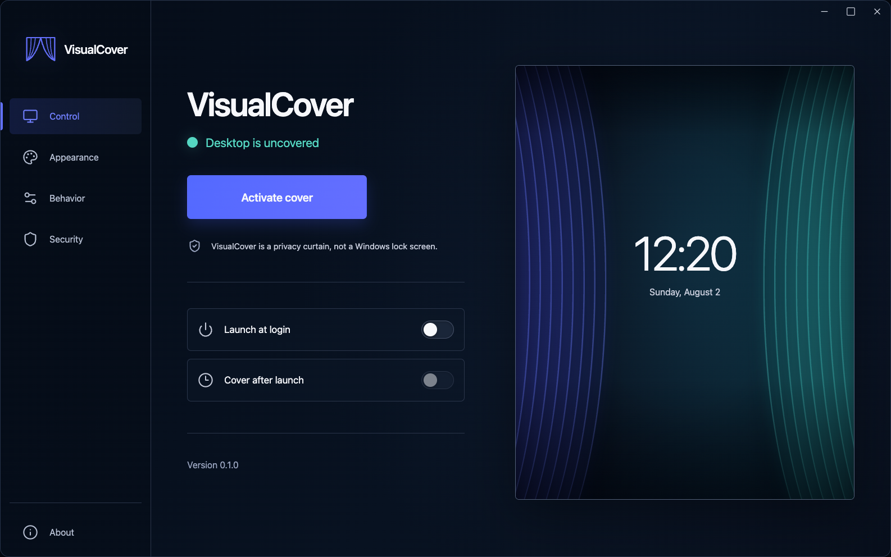
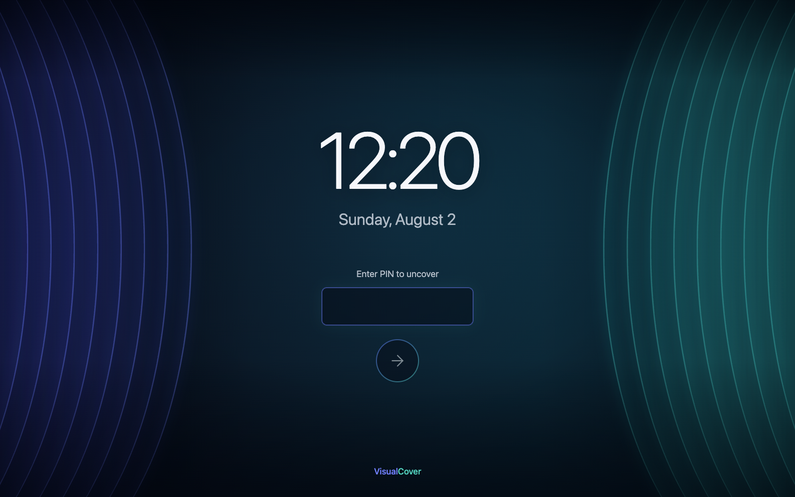
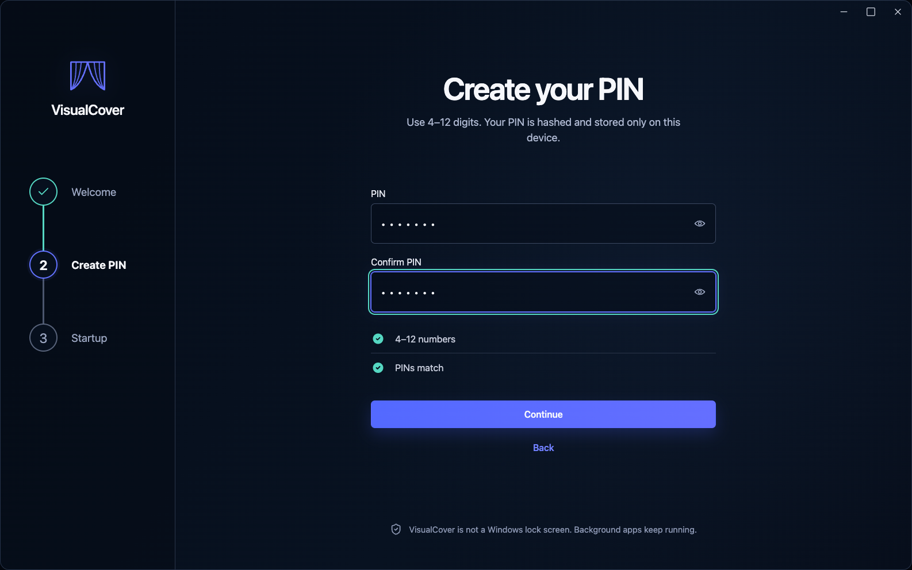
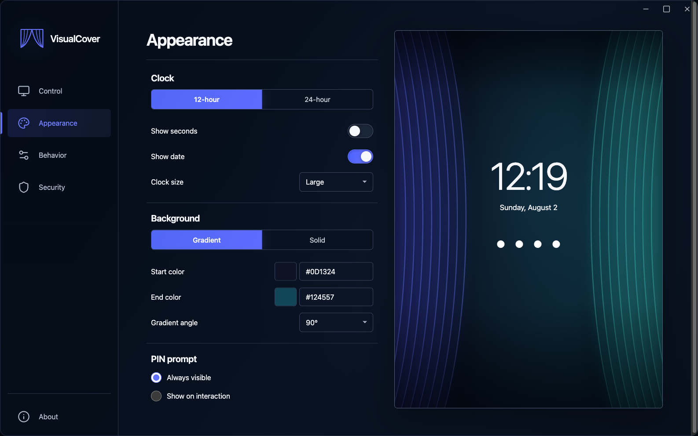

# VisualCover

VisualCover is a visual privacy cover for Windows 11. It places a calm,
full-screen desktop curtain over every connected monitor while Windows stays
signed in and ordinary background programs continue running.

> [!IMPORTANT]
> VisualCover is **not** the Windows lock screen and is not a security boundary.
> It is a casual-access barrier that can hide the desktop from a passerby. Use
> the real Windows lock screen whenever you need operating-system security.

Version 0.1.0 targets 64-bit Windows 11. macOS is supported as a development
environment with graceful fallbacks for Windows-only behavior.

## What it does

- Covers each detected monitor with a borderless, always-on-top window.
- Shows a configurable clock, date, and solid or gradient background.
- Requires the locally configured 4–12 digit PIN to uncover the desktop.
- Stores only an Argon2id PIN hash in the current user's app-data directory.
- Supports launch at sign-in, optional cover-after-launch, optional Windows
  idle activation, a tray menu, and an opt-in emergency unlock shortcut.
- Leaves the current Windows session and background applications running.

VisualCover does not lock Windows, switch users, create another desktop
session, suspend applications, block the network, install system-wide
input-blocking hooks, or stop synthetic input globally. Its optional emergency
shortcut is a registered
hotkey, not a system-wide input blocker. It does not try to imitate Windows
branding.

## Development screenshots

These captures show the implemented release candidate running through its
bundled, test-only native bridge on macOS at 1586×992. They contain no private
desktop data and are visual-development evidence, not proof of Windows hardware
behavior.

| Main control | Primary cover |
| --- | --- |
|  |  |

| Create PIN | Appearance |
| --- | --- |
|  |  |

The six approved concepts remain unchanged in
[`docs/design/approved`](docs/design/approved). Current primary/secondary cover,
Welcome, Behavior, and Security captures are in
[`docs/screenshots`](docs/screenshots). The concept-to-runtime review is recorded
in the [fidelity ledger](docs/VISUAL-FIDELITY-LEDGER.md).

## Install on Windows

### From a release

1. Open the repository's
   [latest release](https://github.com/Manateek1/visual-cover/releases/latest).
2. Download `VisualCover_0.1.0_x64-setup.exe` from **Assets**.
3. Run the installer. It installs for the current user; administrator access is
   not normally required. If WebView2 is absent, the installer downloads the
   Microsoft WebView2 runtime, so that first install needs internet access.
4. Start **VisualCover** from the Start menu and complete the short setup.

VisualCover 0.1.0 is unsigned. Windows SmartScreen may show **Windows protected
your PC**. Confirm that the file came from this repository, choose **More
info**, verify the app name, and then choose **Run anyway** only if you trust
the download. A warning by itself is expected for an unsigned new application;
never ignore a mismatched filename or an untrusted download source.

### From a successful GitHub Actions run

1. Open the repository's **Actions** tab and select the **Windows** workflow.
2. Open a successful run for the commit you want.
3. Under **Artifacts**, download
   `VisualCover-0.1.0-windows-x64-installer`.
4. Extract the downloaded ZIP and run
   `VisualCover_0.1.0_x64-setup.exe`.

GitHub requires an authenticated account to download workflow artifacts.
Release assets are the normal public-download path.

### Uninstall

If **Launch at login** is enabled, turn it off in VisualCover before removal so
the per-user startup entry is cleared. Then open **Settings → Apps → Installed
apps**, find **VisualCover**, open its menu, and choose **Uninstall**. The
per-user configuration may remain at
`%APPDATA%\com.dillonnagar.visualcover`; delete that directory after uninstall
only if you also want to remove the saved preferences and PIN hash.

## First run and everyday use

On first launch, VisualCover explains its visual-only protection, asks for a
numeric PIN and confirmation, and offers startup settings. Setup always finishes
uncovered. Use **Activate Cover** from the main window or tray when ready.

Enter the PIN on the primary monitor to uncover. An incorrect PIN is cleared and
briefly reported without revealing it. The raw PIN is never saved. Changing the
PIN requires the current PIN. A short numeric PIN can still be guessed offline
if someone obtains the settings file, so use the full supported length when
that risk matters.

**Launch at login** starts VisualCover in the signed-in user's interactive
session; it does not install a Windows service. **Cover after launch** is a
separate option and applies only after onboarding is complete. When launch at
login is enabled without cover-after-launch, the app starts quietly in the
tray. Windows idle activation is optional and disabled by default. Accurate
system idle detection is unavailable in macOS development builds.

The emergency unlock shortcut is disabled by default because it bypasses the
PIN. Enabling or changing it requires the current PIN. When enabled, it only
removes the visual cover; it does not quit VisualCover.

## Background applications and automation

VisualCover is designed to leave Plex, Python, Chrome, Playwright, Fooocus,
qBittorrent, scheduled tasks, file transfers, and similar background work
alone. Compatibility mode is on by default so the cover does not repeatedly
steal focus.

Browser automation that communicates with Chrome through Playwright's DOM/CDP
interfaces can normally continue without owning the visible foreground.
Coordinate-based tools that click screen positions or type into whichever app
has focus are different: the cover is intentionally the visible foreground and
that style of automation is unsupported while covered.

### GoodMorningBot verification procedure

Use a designated WhatsApp test chat and non-sensitive test content. Do not make
VisualCover part of the bot, change the bot's scheduled task, or alter its
credentials for this test.

1. On the Windows 11 test machine, run GoodMorningBot uncovered once and verify
   that Python, Fooocus, Chrome, Playwright, and WhatsApp Web complete a normal
   image send.
2. Record the test start time, the latest generated-image filename and modified
   time, and the latest bot-log entry. In Task Manager or PowerShell, record the
   process IDs and start times for the relevant Python and Chrome processes.
   Include Plex and any other server process that must remain available.
3. Confirm compatibility mode is enabled, then activate VisualCover. Do not use
   the Windows lock command, switch user, or minimize the application.
4. Trigger the bot through its existing schedule or its normal documented
   launch method. Leave the cover active for the entire generation and send.
5. From another phone or computer, confirm that the designated WhatsApp test
   chat receives the new image and that its timestamp is after the cover was
   activated. Do not uncover merely to inspect WhatsApp on the test machine.
6. Unlock VisualCover with the PIN. Confirm that a new image file exists, its
   modified time is within the test window, and the bot log records successful
   generation, browser interaction, upload, and send.
7. Compare the process snapshot. Confirm VisualCover did not terminate or
   suspend Python, Fooocus, Chrome, Plex, or the other recorded processes.
   Normal child-process churn is acceptable; forced termination or a stalled
   service is not.
8. If the covered run fails, repeat the same bot run uncovered. Compare logs and
   timings before assigning the failure to VisualCover. Check whether the bot
   relies on foreground coordinates or OS-level keystrokes; those interactions
   are outside VisualCover's supported automation model.

Record the machine, monitor layout, VisualCover version, compatibility-mode
state, bot result, artifact evidence, log evidence, and second-device delivery
result in the [Windows 11 checklist](docs/WINDOWS-11-TEST-CHECKLIST.md).

## macOS development setup

Prerequisites:

- macOS with Xcode Command Line Tools (`xcode-select --install`)
- Node.js `24.18.1` (the repository includes `.nvmrc`)
- Rust `1.97.1` through rustup (the repository includes
  `rust-toolchain.toml`)

Install and start the application:

```sh
nvm install
nvm use
npm ci
npm run tauri -- dev
```

The macOS build provides a useful single-monitor development mode and tray
behavior. Windows extended window styles, Windows idle detection, mixed-DPI
monitor behavior, and NSIS packaging still require Windows validation.

Useful commands:

```sh
npm run lint
npm run typecheck
npm run test
npm run build
npm run check
cargo fmt --manifest-path src-tauri/Cargo.toml --all -- --check
cargo clippy --manifest-path src-tauri/Cargo.toml --all-targets --all-features -- -D warnings
cargo test --manifest-path src-tauri/Cargo.toml --all-features
npm run tauri -- build --bundles app
```

`npm run check` verifies synchronized versions, linting, TypeScript, frontend
tests, and the production frontend build. The final command builds a macOS app;
the Windows NSIS installer is built on GitHub Actions.

## CI and releases

The **Windows** workflow runs on `windows-latest` for pushes to `main`, pull
requests, and manual dispatches. It installs the pinned Node and Rust versions,
runs all frontend and Rust gates, builds the NSIS bundle, asserts the exact
installer filename, and uploads it as a workflow artifact.

Pushing a matching version tag such as `v0.1.0` runs the **Release** workflow.
The tag must match the versions in `package.json`, Cargo, and Tauri. A successful
run creates a public, non-draft GitHub Release and attaches the unsigned NSIS
installer using only the repository-provided `GITHUB_TOKEN`.

No Windows hardware behavior should be described as verified until the
[Windows 11 checklist](docs/WINDOWS-11-TEST-CHECKLIST.md) is completed on a real
machine. Maintainers should follow the
[release checklist](docs/RELEASE-CHECKLIST.md) before tagging.

## Security limitations

VisualCover cannot defend against Task Manager, Ctrl+Alt+Delete or another
secure-desktop transition, user switching, UAC prompts, accessibility or system
shortcuts, elevated software, coordinate-based foreground automation, reboot,
process termination, application crashes, or someone who can read or alter the
current user's files. The desktop may become visible during those events.

It is deliberately a visual curtain, not authentication, encryption, or an
endpoint-security product. See [SECURITY.md](SECURITY.md) for reporting a
vulnerability and [CONTRIBUTING.md](CONTRIBUTING.md) before proposing changes.

## License

[MIT](LICENSE) © 2026 Dillon Nagar.
